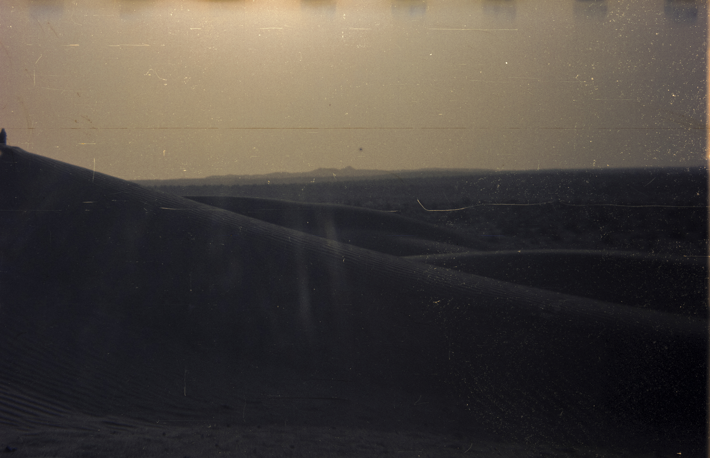

INDEX OF ARTIFACTS AND FORMS > > >
 

o o o o |
o o o o | STARRY EYED AND LOST IN THE HAZE OF THE DREAMLINE
o o o o | VOLUME 001: FROM BEFORE, BACK WHEN I WAS IN LOVE.
o o o o |

 


* o o o | THE WAVES AND THE DUNES. KEEP PULLING ME BACK. TO YOU. //
o o o o | SOMEWHERE IN THE GREAT THAR DESERT. AT DUSK. //
o o o o | HOLGA 120 GFCN HACKED TO SHOOT CHINA LUCKY FILM SUPER 200
o o o o | RED RIVER ULTRAPRO LUSTER 300 17x25 //

 


* * o o | SAGARMATHA. THE HEAD OF THE GODDESS IN THE GREAT BLUE SKY //
o o o o | TIGER HILL AT DAWN, SUNRISE OVER EVEREST, THE ROOF OF THE WORLD. V1 //
o o o o | HOLGA 120 GFCN HACKED TO SHOOT EXPIRED FUJIFILM SUPERIA XTRA 800 //
o o o o | RED RIVER ULTRAPRO LUSTER 300 17x25 //

 


* * * o | SAGARMATHA. THE HEAD OF THE GODDESS IN THE GREAT BLUE SKY //
o o o o | TIGER HILL AT DAWN, SUNRISE OVER EVEREST, THE ROOF OF THE WORLD. V2 //
o o o o | HOLGA 120 GFCN HACKED TO SHOOT EXPIRED FUJIFILM SUPERIA XTRA 800 //
o o o o | RED RIVER ULTRAPRO LUSTER 300 17x25 //

 


* * * * | SAGARMATHA. THE HEAD OF THE GODDESS IN THE GREAT BLUE SKY //
o o o o | TIGER HILL AT DAWN, SUNRISE OVER EVEREST, THE ROOF OF THE WORLD. V3 //
o o o o | HOLGA 120 GFCN HACKED TO SHOOT EXPIRED FUJIFILM SUPERIA XTRA 800 //
o o o o | RED RIVER ULTRAPRO LUSTER 300 17x25 //

 


* * * * | SAGARMATHA. THE HEAD OF THE GODDESS IN THE GREAT BLUE SKY //
* o o o | TIGER HILL AT DAWN, SUNRISE OVER EVEREST, THE ROOF OF THE WORLD. V4 //
o o o o | HOLGA 120 GFCN HACKED TO SHOOT EXPIRED FUJIFILM SUPERIA XTRA 800 //
o o o o | RED RIVER ULTRAPRO LUSTER 300 17x25 //

 


* * * * | RAINBOW DREAMS OF TROPICAL SCENES. V1 //
* * o o |
o o o o | HOLGA 120 GFCN HACKED TO SHOOT EXPIRED KODAK GOLD 400 //
o o o o | RED RIVER ULTRAPRO LUSTER 300 17x25 //

 


* * * * | RAINBOW DREAMS OF TROPICAL SCENES. V2 //
* * * o |
o o o o | HOLGA 120 GFCN HACKED TO SHOOT EXPIRED KODAK GOLD 400 //
o o o o | RED RIVER ULTRAPRO LUSTER 300 17x25 //

 


* * * * | SPLIT SCENES OF TROPICAL DREAMS. //
* * * * |
o o o o | HOLGA 120 GFCN HACKED TO SHOOT EXPIRED KODAK GOLD 400 //
o o o o | RED RIVER ULTRAPRO LUSTER 300 17x25 //

 


* * * * | TURBULENT SCENES OF TROPICAL DREAMS. //
* * * * |
* o o o | HOLGA 120 GFCN HACKED TO SHOOT EXPIRED KODAK GOLD 400 //
o o o o | RED RIVER ULTRAPRO LUSTER 300 17x25 //

 


* * * * | ALMOST FOUND CLARITY ONCE. //
* * * * |
* * o o | HOLGA 120 GFCN HACKED TO SHOOT EXPIRED KODAK GOLD 400 //
o o o o | RED RIVER ULTRAPRO LUSTER 300 17x25 //

 


* * * * | SPLIT SCENES OF RED GHOSTS AND ALPINE DREAMS. //
* * * * |
* * * o | HOLGA 120 GFCN HACKED TO SHOOT EXPIRED KODAK GOLD 400 //
o o o o | RED RIVER ULTRAPRO LUSTER 300 17x25 //

